<div align="center">

# Metinden Çipe: Yapay Zeka ile Uçtan Uca Otomatize Donanım Tasarımı

### `Text2Chip — LibreLane AI`

**Açık Kaynak EDA Araçları ve Yapay Zekâ ile Sıfır Teknik Bilgiyle ASIC Tasarımı**

*Erzurum Teknik Üniversitesi · Mühendislik ve Mimarlık Fakültesi · Bilgisayar Mühendisliği Bölümü*
*Lisans Bitirme Projesi — 2026*

<br/>

[](#)
[](#-backend--librelane-ai-backend)
[](#-frontend--librelane-ai-frontend)
[](#-yapay-zeka-katmanı)
[](#-eda-akışı-rtl--gdsii)

</div>

---

> [!IMPORTANT]
> **Tek cümlede:** Kullanıcı bir web arayüzüne *doğal dille* ne istediğini yazar → yapay zekâ Verilog kodunu üretir, EDA akışını tetikler, ortaya çıkan hataları otonom olarak onarır → sonuçta fabrikada bastırılmaya hazır bir **GDSII çip layout'u** ortaya çıkar. **Arada hiçbir teknik ön bilgi gerekmez.**

---

## İçindekiler

- [Vizyon ve Motivasyon](#-vizyon-ve-motivasyon)
- [Sistem Mimarisi](#-sistem-mimarisi)
- [Uçtan Uca Akış: Metinden Çipe](#-uçtan-uca-akış-metinden-çipe)
- [Yapay Zeka Katmanı](#-yapay-zeka-katmanı)
- [EDA Akışı (RTL → GDSII)](#-eda-akışı-rtl--gdsii)
- [Otonom Atölye (Self-Healing Optimizasyon)](#-otonom-atölye-self-healing-optimizasyon)
- [Backend — `librelane-ai-backend`](#-backend--librelane-ai-backend)
- [Frontend — `librelane-ai-frontend`](#-frontend--librelane-ai-frontend)
- [Demo Donanım: 16-bit CPU](#-demo-donanım-16-bit-cpu)
- [Gelecek Çalışma: Qdrant Vektör Tabanlı RAG](#-gelecek-çalışma-qdrant-vektör-tabanlı-rag)
- [Kurulum ve Çalıştırma](#-kurulum-ve-çalıştırma)
- [Proje Yapısı](#-proje-yapısı)
- [Ekip](#-ekip)

---

## 🎯 Vizyon ve Motivasyon

Çip tasarımı, yarı iletken teknolojilerinin ilerlemesiyle birlikte bilgisayar mühendisliğinin en **kritik ve stratejik** alanlarından biri hâline geldi. Çipler artık yalnızca bilgisayarlarda değil; ev aletlerinden en gelişmiş savunma sistemlerine kadar **her elektronik cihazın kalbinde** yer alıyor.

Ancak bu alanın önünde iki büyük bariyer var:

| 🚧 Tespit Edilen Sorun | 💡 Bizim Yaklaşımımız |
|---|---|
| **Maliyet & Lisans:** Geleneksel ASIC akışları lisans maliyeti çok yüksek, kapalı kaynaklı ticari araçlar gerektirir. | Tamamen **açık kaynak** EDA zinciri: OpenLane + Yosys + SkyWater 130 PDK. |
| **Erişim Engeli:** Ücret ödense bile büyük üreticiler ekosistemi tekelleştirdiği için araçlara akademik erişim kısıtlıdır. | Web arayüzünden, kurulum derdi olmadan, **herkesin erişebileceği** bir platform. |
| **Yüksek Teknik Bariyer:** Çip tasarımı çok yüksek teknik ön bilgi gerektirir. | **Yapay zekâ destekli otonomi:** kullanıcı sadece amacını anlatır, sistem geri kalanını halleder. |

> [!NOTE]
> **Stratejik Önem:** Yapay zekâ çağında, ülkemizin çip üretim teknolojilerinde bilgi ve deneyim sahibi olması hayati önemdedir. Hedefimiz; ilk aşamada temel elektronik cihazlar için yerli çipler üreterek dışa bağımlılığı azaltmak ve bu alanda güçlü bir Ar-Ge bilgi birikimi kazandırmaktır.

---

## 🏗️ Sistem Mimarisi

Sistem; **kullanıcı arayüzü**, **orkestrasyon backend'i**, **yerel LLM** ve **konteynerize EDA çalıştırıcısı** olmak üzere dört ana katmandan oluşur.

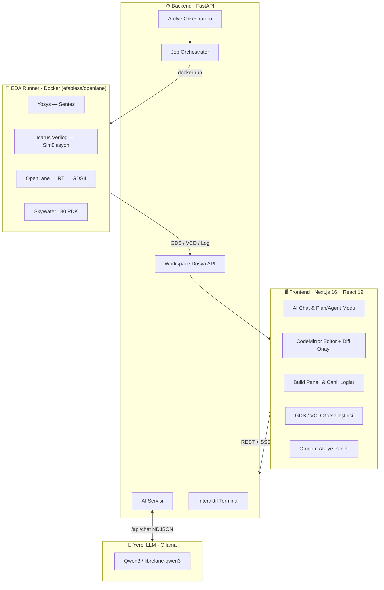
```mermaid
flowchart TB
    subgraph UI["🖥️ Frontend · Next.js 16 + React 19"]
        Chat["AI Chat & Plan/Agent Modu"]
        Editor["CodeMirror Editör + Diff Onayı"]
        Build["Build Paneli & Canlı Loglar"]
        Viewer["GDS / VCD Görselleştirici"]
        Atolye["Otonom Atölye Paneli"]
    end

    subgraph BE["⚙️ Backend · FastAPI"]
        AI["AI Servisi"]
        Runner["Job Orchestrator"]
        Files["Workspace Dosya API"]
        Autonom["Atölye Orkestratörü"]
        Term["İnteraktif Terminal"]
    end

    subgraph LLM["🧠 Yerel LLM · Ollama"]
        Qwen["Qwen3 / librelane-qwen3"]
    end

    subgraph EDA["🔬 EDA Runner · Docker (efabless/openlane)"]
        Yosys["Yosys — Sentez"]
        IVerilog["Icarus Verilog — Simülasyon"]
        OL["OpenLane — RTL→GDSII"]
        PDK["SkyWater 130 PDK"]
    end

    UI <-->|REST + SSE Stream| BE
    AI <-->|/api/chat NDJSON| LLM
    Runner -->|docker run| EDA
    Autonom --> Runner
    EDA -->|GDS / VCD / Log| Files
    Files --> UI
```

| Katman | Sorumluluk | Teknoloji |
|---|---|---|
| **Frontend** | Doğal dil etkileşimi, kod editörü, build izleme, görselleştirme | Next.js 16, React 19, TypeScript 5, Tailwind v4 |
| **Backend** | Orkestrasyon, job yönetimi, AI köprüsü, dosya API'si | FastAPI, SQLModel, SSE (sse-starlette), Docker SDK |
| **Yapay Zekâ** | Verilog üretimi, log analizi, self-healing | Ollama + Qwen3 (yerel, çevrimdışı) |
| **EDA** | RTL sentezi, simülasyon, fiziksel tasarım | OpenLane, Yosys, Icarus Verilog, SkyWater 130 |

---

## 🔄 Uçtan Uca Akış: Metinden Çipe

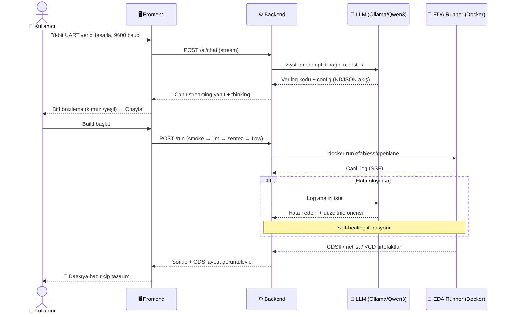
```mermaid
sequenceDiagram
    actor U as 👤 Kullanıcı
    participant F as 🖥️ Frontend
    participant B as ⚙️ Backend
    participant L as 🧠 LLM (Ollama/Qwen3)
    participant D as 🔬 EDA Runner (Docker)

    U->>F: "8-bit UART verici tasarla, 9600 baud"
    F->>B: POST /ai/chat (stream)
    B->>L: System prompt + bağlam + istek
    L-->>B: Verilog kodu + config (NDJSON akış)
    B-->>F: Canlı streaming yanıt + thinking
    F-->>U: Diff önizleme (kırmızı/yeşil) → Onayla
    U->>F: Build başlat
    F->>B: POST /run (smoke → lint → sentez → flow)
    B->>D: docker run efabless/openlane
    D-->>B: Canlı log (SSE)
    alt Hata oluşursa
        B->>L: Log analizi iste
        L-->>B: Hata nedeni + düzeltme önerisi
        Note over B,D: Self-healing iterasyonu
    end
    D-->>B: GDSII / netlist / VCD artefaktları
    B-->>F: Sonuç + GDS layout görüntüleyici
    F-->>U: 🎉 Baskıya hazır çip tasarımı
```

**5 adımda kullanım:**

1. **Anlat** — Sol panelden proje seç/oluştur, chat'e doğal dille isteğini yaz.
2. **Üret** — AI, Verilog kodu + OpenLane config önerisi sunar; IDE diff olarak gösterir.
3. **Onayla** — Kırmızı/yeşil farkı incele, kabul et → dosyalar workspace'e yazılır.
4. **Çalıştır** — Build panelinden EDA akışını tetikle, canlı logları izle.
5. **Gör** — Çıkan GDSII layout'u ve dalga formlarını arayüzde görselleştir.

---

## 🧠 Yapay Zeka Katmanı

Sistem, **tamamen yerel** çalışan bir LLM altyapısı kullanır — veri dışarı çıkmaz, internet bağımlılığı yoktur.

- **Çalıştırma motoru:** [Ollama](https://ollama.com) (inference)
- **Model:** Qwen3 ailesi (`librelane-qwen3` olarak özelleştirilmiş Modelfile)
- **Roller (mod tabanlı sistem promptu):**
  - 🤖 **Agent Modu** — doğrudan kod/dosya üretir, tam dosya içeriğini diff formatında verir
  - 📋 **Plan Modu** — uygulamadan önce adım adım plan üretir (`Hedef / Adımlar / Riskler / Sonraki aksiyon`)
- **Streaming:** Ollama `/api/chat` NDJSON akışı; modelin hem **yanıtı** hem de **düşünce (thinking)** zinciri canlı olarak UI'da gösterilir.
- **Log analizi & self-healing:** EDA aracından dönen hata logları modele verilir; model `özet / başarı-hata / olası neden / sonraki adım` formatında çözüm üretir.

<div align="center">

| Sistemdeki modeller |
|:---:|
| 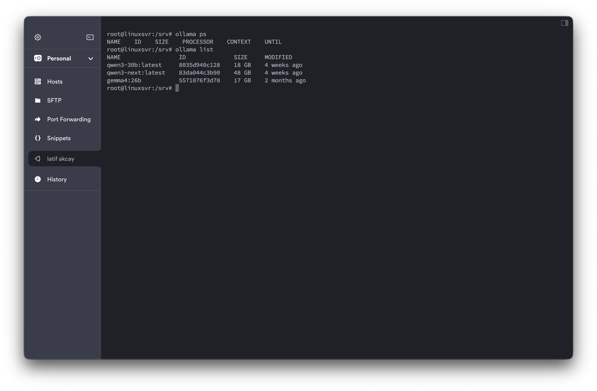 |

</div>

> [!TIP]
> Modeli kendi kurallarınızla yönlendirmek için `Modelfile` kullanılır — sentezlenebilirlik kuralları, `always @(posedge clk ...)` blok yapısı, blocking/non-blocking atama disiplini gibi kurallar few-shot örneklerle modele kalıcı olarak öğretilir.

---

## 🔬 EDA Akışı (RTL → GDSII)

Tüm EDA araçları izole **Docker konteynerlerinde** (`efabless/openlane:ci2504-dev-amd64`) çalışır. Backend her aracı bir **job** olarak kuyruğa alır, canlı loglarını yayınlar ve artefaktlarını workspace'e yazar.

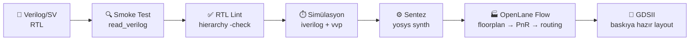
```mermaid
flowchart LR
    A["📝 Verilog/SV<br/>RTL"] --> B["🔍 Smoke Test<br/>read_verilog"]
    B --> C["✅ RTL Lint<br/>hierarchy -check"]
    C --> D["⏱️ Simülasyon<br/>iverilog + vvp"]
    D --> E["⚙️ Sentez<br/>yosys synth"]
    E --> F["🏭 OpenLane Flow<br/>floorplan → PnR → routing"]
    F --> G["💾 GDSII<br/>baskıya hazır layout"]
```

| Araç | Açıklama | Çıktı |
|---|---|---|
| **Smoke Test** | Yosys ile Verilog'un okunabilirliğini doğrular | Hızlı doğrulama |
| **RTL Lint** | Hiyerarşi & okunabilirlik kontrolü | Uyarı/hata raporu |
| **Simülasyon** | Icarus Verilog ile testbench koşturur | `wave.vcd` |
| **Sentez** | Gate-level netlist üretir | `netlist.v` |
| **OpenLane Flow** | Floorplan, placement, routing — fiziksel tasarım | `GDSII` |

Akış adımları (`floorplan`, `placement`, `cts`, `routing`...) UI'dan **parçalı** olarak seçilebilir; PDK olarak **SkyWater 130** kullanılır.

---

## 🤖 Otonom Atölye (Self-Healing Optimizasyon)

"Atölye", bir tasarım parametresini (ör. `DIE_AREA`, `CLOCK_PERIOD`) **başlangıç → hedef** aralığında otomatik tarayan, her değer için config'i patch'leyip tüm EDA akışını koşturan bir **kampanya orkestratörüdür**.

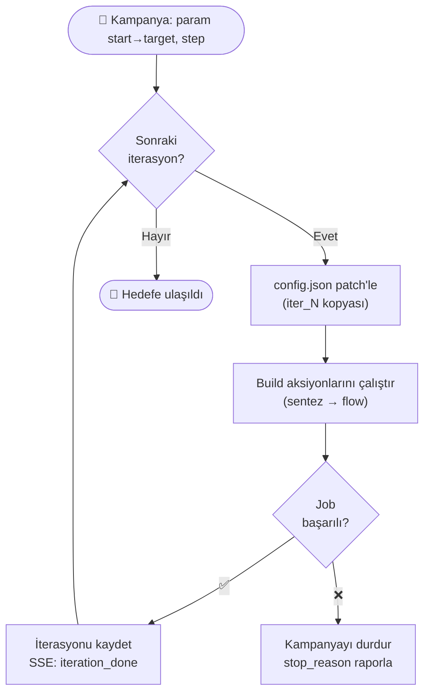
```mermaid
flowchart TD
    Start(["🎯 Kampanya: param start→target, step"]) --> Iter{"Sonraki<br/>iterasyon?"}
    Iter -->|Evet| Patch["config.json patch'le<br/>(iter_N kopyası)"]
    Patch --> Run["Build aksiyonlarını çalıştır<br/>(sentez → flow)"]
    Run --> Check{"Job<br/>başarılı?"}
    Check -->|✅| Save["İterasyonu kaydet<br/>SSE: iteration_done"]
    Save --> Iter
    Check -->|❌| Fail["Kampanyayı durdur<br/>stop_reason raporla"]
    Iter -->|Hayır| Done(["🏁 Hedefe ulaşıldı"])
```

- Her iterasyon kendi config kopyası ve job'larıyla **izole** edilir.
- İlerleme **SSE stream** ile canlı yayınlanır (`iteration_started`, `job_started`, `iteration_done`, `done`).
- Kullanıcı kampanyayı istediği an **iptal** edebilir; eşzamanlı kampanya limiti yapılandırılabilir.

---

## ⚙️ Backend — `librelane-ai-backend`

FastAPI tabanlı orkestrasyon servisi. Workspace dosya API'si, job yönetimi, AI köprüsü ve EDA çalıştırıcısını servis eder.

**Öne çıkan modüller:**

```
app/
├── routes/          # REST + SSE uçları (ai, run, jobs, files, autonom, terminal, layout, system)
├── services/        # ai_service, runner, autonom_orchestrator, openlane_layout, ollama_runtime ...
├── core/            # config (env), db (SQLModel), storage (workspace I/O)
├── models/          # job, autonom_campaign, chat_history
└── tools_catalog.py # EDA araç tanımları (smoke/lint/sim/synth/flow)
```

**Başlıca API uçları:**

| Grup | Uç | İşlev |
|---|---|---|
| AI | `POST /ai/chat` · `POST /ai/analyze` | Streaming sohbet, log analizi |
| AI | `GET/PUT /ai/ollama/config` · `GET /ai/ollama/models` | Model yönetimi |
| Run | `POST /run` · `GET /run/{id}/stream` | EDA job başlat + canlı log |
| Jobs | `GET /jobs` · `GET /jobs/{id}/log` | Job geçmişi & logları |
| Files | `GET/PUT/DELETE /files/{project}/...` | Workspace dosya CRUD |
| Autonom | `POST /autonom/campaigns` · `GET .../stream` | Otonom kampanya + SSE |
| Layout | `GET /layout/preview/{project}` | GDS/layout önizleme |
| System | `GET /system/metrics` | CPU/RAM/GPU/disk telemetrisi |

**Teknoloji:** FastAPI · Uvicorn · SQLModel · Pydantic · Docker SDK · sse-starlette · Ollama (Python istemci) · psutil

---

## 🖥️ Frontend — `librelane-ai-frontend`

Next.js 16 (App Router) + React 19 ile yazılmış, mühendislik odaklı bir IDE deneyimi.

**Öne çıkan bileşenler:**

| Alan | Bileşen | İşlev |
|---|---|---|
| 💬 Chat | `ChatThread`, `MessageList`, `PlanApprovalBar` | Streaming AI sohbeti, plan/agent modu |
| ✏️ Editör | `CodeMirrorEditorPane`, `DiffViewer`, `OpenlaneConfigEditorPane` | Kod editörü, diff onayı, config autocomplete |
| 🔨 Build | `BuildFlowStrip`, `RightPanel`, `OpenlaneFlowStagePicker` | EDA akışı kontrolü & canlı çıktı |
| 👁️ Görselleştirme | `GdsLayoutViewer`, `VcdWaveformViewer` | Çip layout'u & dalga formu |
| 🤖 Atölye | `AutonomWorkshopPane` | Otonom kampanya sihirbazı |
| 🖧 Terminal | `WorkspaceTerminal`, `InteractiveShellPane` | xterm.js tabanlı interaktif terminal |

**Teknoloji:** Next.js 16 · React 19 · TypeScript 5 · Tailwind CSS v4 · Radix UI · CodeMirror 6 · xterm.js · Shiki · Recharts · react-markdown

---

## 💾 Demo Donanım: 16-bit CPU

Sistemin uçtan uca doğrulaması için saf Verilog ile **16-bit basit bir işlemci** tasarlandı; ALU, komut belleği (IMEM), veri belleği (DMEM) ve üst seviye sistem modülünden oluşur.

```
src/16bit-cpu/
├── src/cpu/   alu.v · simple16_cpu.v
├── src/mem/   instr_mem.v · data_mem.v
├── src/top/   simple16_system.v
└── tb/        simple16_system_tb.v
```

### Testbench & Simülasyon Çıktısı

<div align="center">

| Testbench Koşumu | Sonuç |
|:---:|:---:|
| 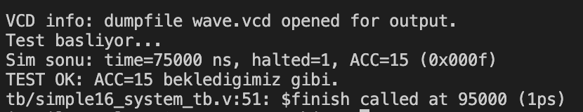 |  |

</div>

### GTKWave Dalga Formları

<div align="center">

| ALU | Komut Belleği (IMEM) | Veri Belleği (DMEM) |
|:---:|:---:|:---:|
| 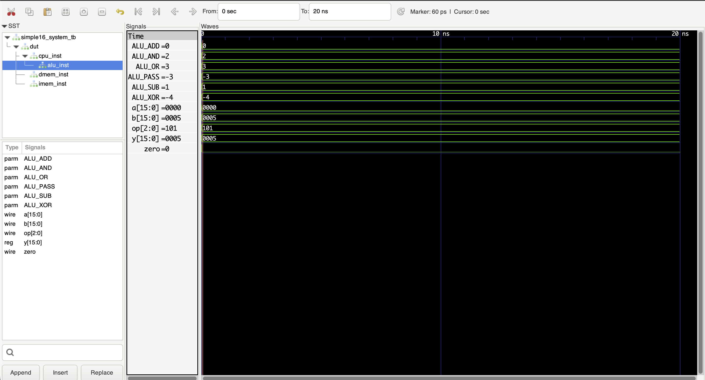 | 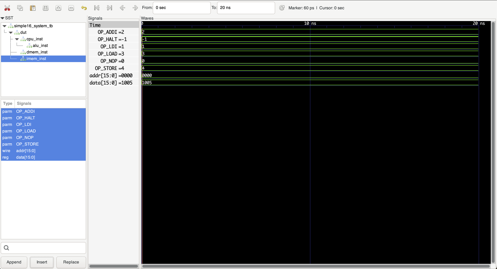 | 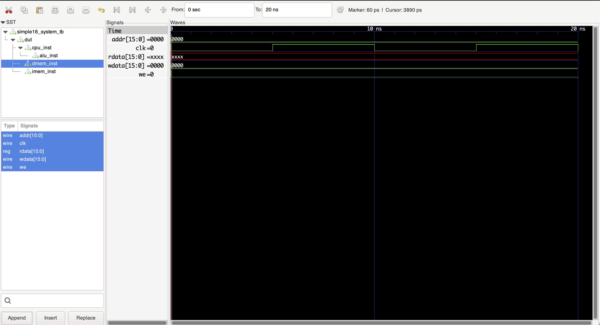 |

</div>

### OpenLane Fiziksel Tasarım Aşamaları

OpenLane akışının her aşaması ayrı ayrı doğrulandı (`docs/16bit-cpu/`):

<div align="center">

| Aşama 0 | Aşama 1 | Aşama 2 | Aşama 3 |
|:---:|:---:|:---:|:---:|
| 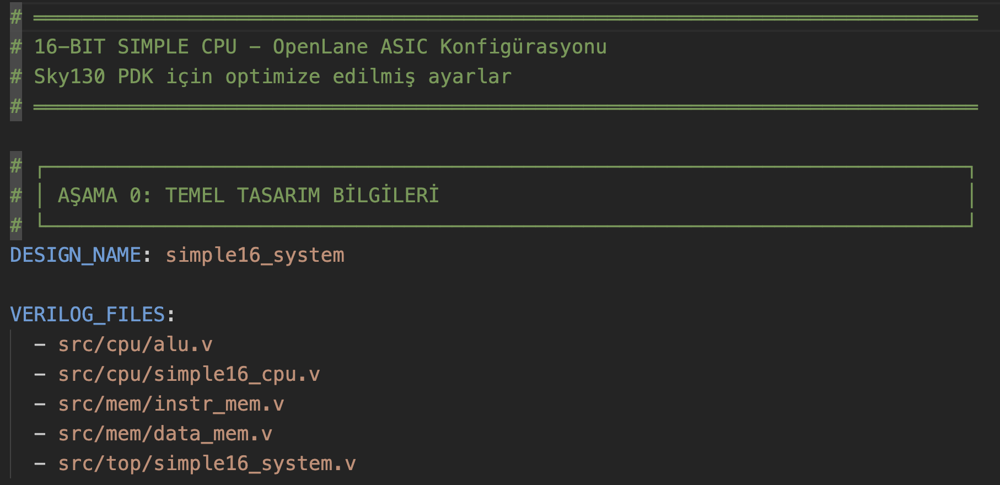 | 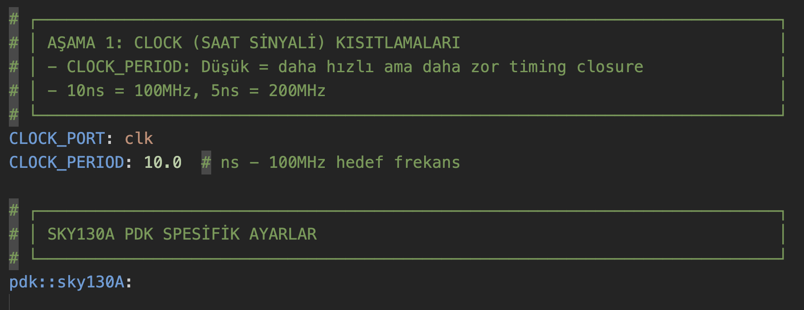 | 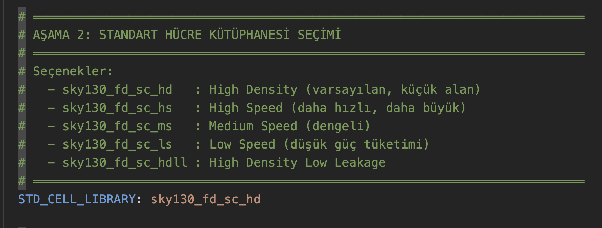 | 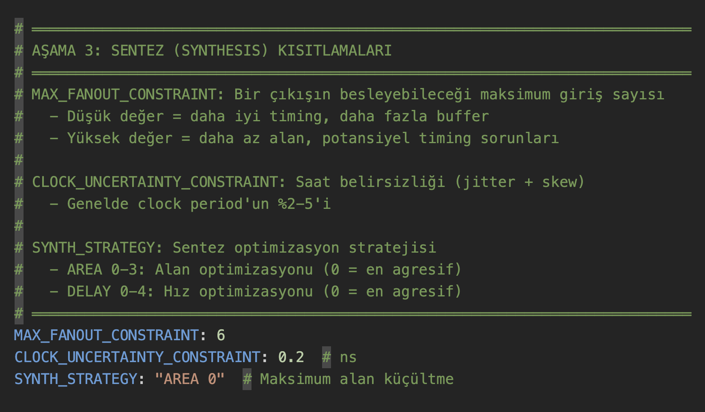 |
| **Aşama 4** | **Aşama 5** | **Aşama 6** | **Aşama 7** |
| 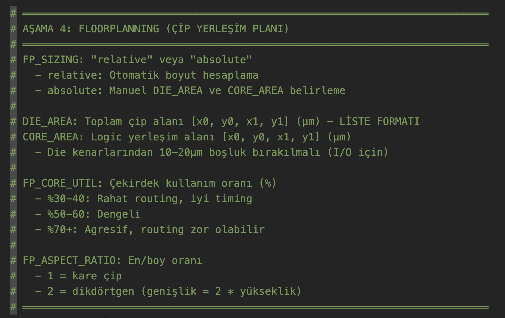 | 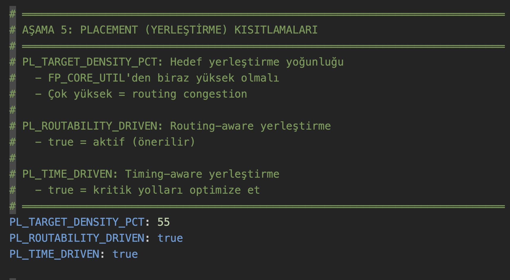 | 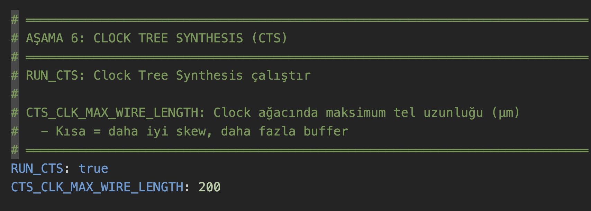 | 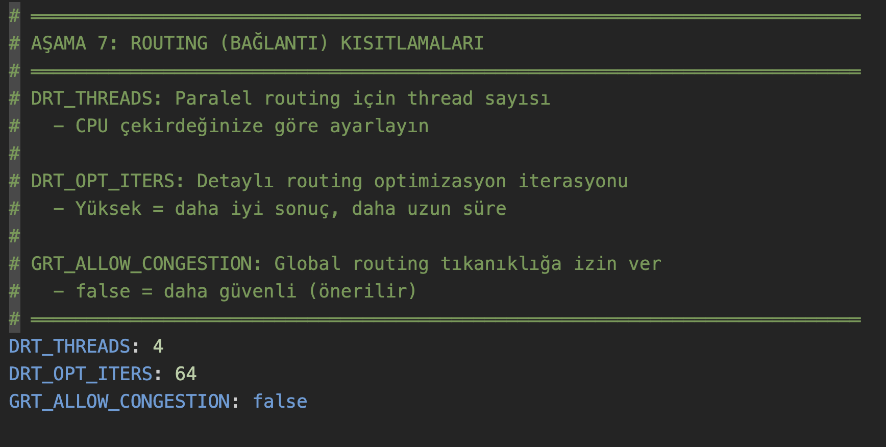 |

</div>

---

## 🚀 Gelecek Çalışma: Qdrant Vektör Tabanlı RAG

> [!NOTE]
> Bu bölüm, **10 Haziran 2026 sunumundan sonra** başlatılan ve hâlen **aktif olarak geliştirilen** çalışmadır. Amaç, modelin Verilog/EDA bilgisini bir **graf/vektör veri tabanı** ile zenginleştirerek sistemin başarı oranını ve kod kalitesini artırmaktır.

### Neden RAG?

LLM'leri doğrudan Ollama üzerinden eğitmek (fine-tuning) mümkün değildir — Ollama yalnızca inference içindir. Bunun yerine modele geniş bir Verilog kütüphanesini **"açık kitap"** olarak sunarız: kullanıcı kod istediğinde, sistem önce vektör veri tabanından en ilgili örnekleri bulur, modele referans olarak paslar.

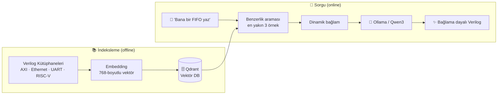
```mermaid
flowchart LR
    subgraph Index["📚 İndeksleme (offline)"]
        Repos["Verilog Kütüphaneleri<br/>AXI · Ethernet · UART · RISC-V"] --> Emb["Embedding<br/>768-boyutlu vektör"]
        Emb --> Q[("🗄️ Qdrant<br/>Vektör DB")]
    end

    subgraph Query["🔎 Sorgu (online)"]
        User["👤 'Bana bir FIFO yaz'"] --> Search["Benzerlik araması<br/>en yakın 3 örnek"]
        Q --> Search
        Search --> Ctx["Dinamik bağlam"]
        Ctx --> Model["🧠 Ollama / Qwen3"]
        Model --> Ans["✨ Bağlama dayalı Verilog"]
    end
```

### Teknik Tercihler

| Parametre | Değer | Gerekçe |
|---|---|---|
| **Vektör veri tabanı** | Qdrant | Yüksek performanslı benzerlik araması, API ile entegrasyon |
| **Vektör boyutu** | **768** | RAG için "altın oran" — kod yapısını/sinyal ilişkilerini ayırt edecek çözünürlük, ama hız & RAM israfı olmadan |
| **Embedding** | Yerel (built-in / LanceDB alternatifi) | Çevrimdışı, maliyetsiz |
| **Mimari** | RAG + Agent | Yüzlerce dosyayı context'i şişirmeden dinamik kütüphane gibi taratır |

### RAG Kaynak Külliyatı (`/srv/rag-learning`)

Yalnızca **sentezlenebilir** ve test edilmiş kütüphaneler indekslenir:

- **01_protocols** — Alex Forencich: `verilog-axi`, `verilog-axis`, `verilog-ethernet`, `verilog-pcie`, `verilog-uart`, `verilog-i2c`, `verilog-wishbone`, `verilog-lfsr`
- **02_standard_libs** — `basejump_stl` (donanımın "C++ STL"i), `surf` (SLAC)
- **03_verification** — `verilog-eval` (Cornell), `serv` (en küçük RISC-V çekirdeği), `VeeRwolf`, `sv2v`
- **04_eda_automation** — `OpenLane`, `yosys`, `verilator`, `fusesoc`, `edalize` (self-healing için hata kılavuzları)

### Eğitim Süreci — Ekran Görüntüleri

<div align="center">

| Qdrant Arayüzü | Başarılı Kurulum |
|:---:|:---:|
| 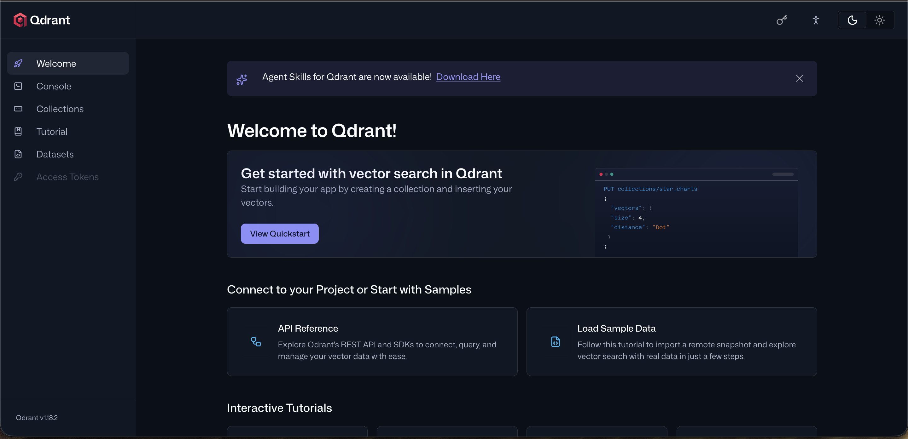 | 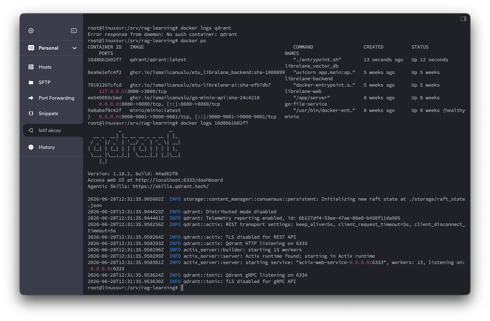 |
| **RAG İndeksi Başladı** | **Devam Eden Eğitim** |
| 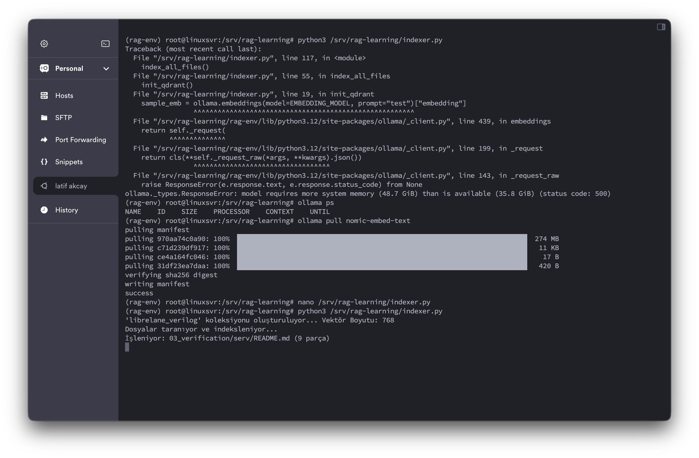 | 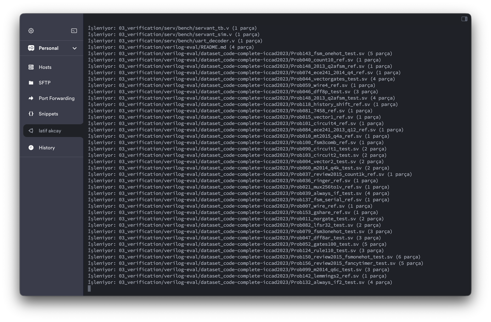 |
| **Eğitim Metrikleri** | **Eğitim Metrikleri (2)** |
| 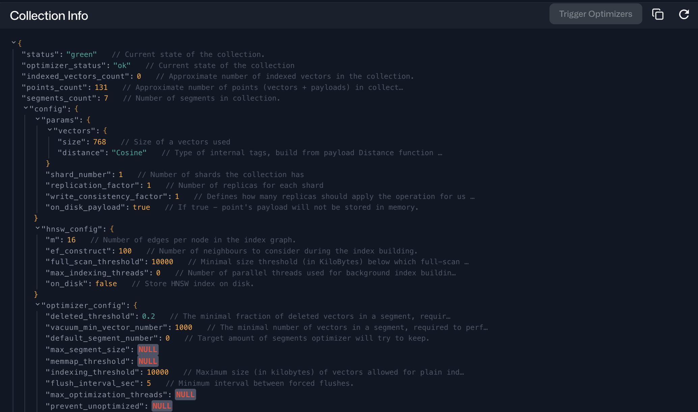 | 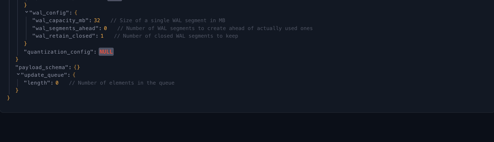 |
| **`serv` İçin Yakın Noktalar Örneği** | **RAG Eğitimi Başarılı** |
| 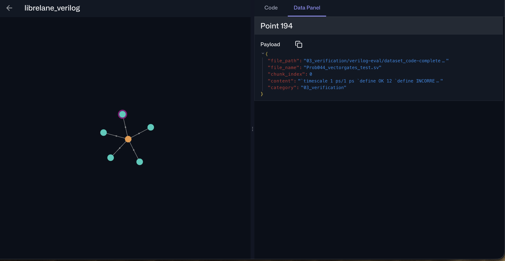 | 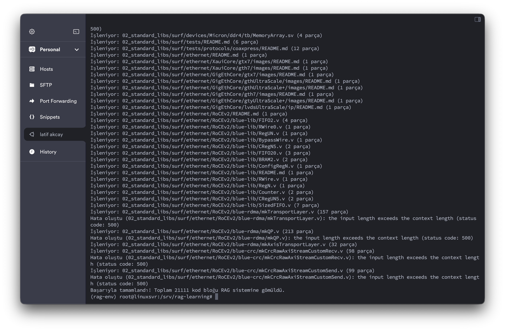 |

</div>

> 📄 Detaylı dokümantasyon: [`docs/ai-modelleri/`](docs/ai-modelleri/) — `rag-kurulumu.md`, `rag-kaynaklari.md`, `egitim-cesitleri.md`, `rag-hazirligi.md`, `egitim-sinirlari.md`, `rag-egitim-sss.md`

---

## 🛠️ Kurulum ve Çalıştırma

### Gereksinimler

- **Docker** (EDA runner ve servisler için)
- **Node.js ≥ 18** (frontend)
- **Python ≥ 3.11** (backend, manuel çalıştırma için)
- **Ollama** (yerel LLM; `qwen3` veya `librelane-qwen3` modeli yüklü)

### 1) Backend

```bash
cd src/libralane-ai-backend
cp .env.example .env          # WORKSPACE_ROOT, PDK yolu vb. ayarla
docker compose up --build     # veya: uvicorn app.main:app --reload --port 8001
```

Sağlık kontrolü:

```bash
curl http://127.0.0.1:8001/health      # {"status":"ok"}
curl http://127.0.0.1:8001/files       # workspace listesi
```

### 2) Frontend

```bash
cd src/librelane-ai-frontend
npm install
npm run dev
```

Tarayıcıda aç: **http://localhost:3000** (otomatik `/chat`'e yönlenir).

### 3) Ollama (yerel LLM)

```bash
ollama pull qwen3
# (opsiyonel) özel kurallı model:
ollama create librelane-qwen3 -f ./Modelfile
```

### Önemli Ortam Değişkenleri (backend `.env`)

| Değişken | Varsayılan | Açıklama |
|---|---|---|
| `WORKSPACE_ROOT` | `./workspace` | Kalıcı proje dosyaları |
| `RUNNER_IMAGE_OPENLANE` | `efabless/openlane:ci2504-dev-amd64` | EDA runner imajı |
| `OPENLANE_PDK_HOST_PATH` | _(boş)_ | Host'taki SkyWater 130 PDK yolu (boşsa imaj içindeki kullanılır) |
| `ENABLE_OPENLANE_TOOLS` | `true` | OpenLane araçlarını etkinleştir |

---

## 📁 Proje Yapısı

```
git-bitirme/
├── src/
│   ├── libralane-ai-backend/     # ⚙️ FastAPI orkestrasyon backend'i
│   ├── librelane-ai-frontend/    # 🖥️ Next.js 16 + React 19 IDE arayüzü
│   └── 16bit-cpu/                # 💾 Demo donanım: 16-bit CPU (Verilog + TB)
├── docs/
│   ├── 16bit-cpu/                # OpenLane aşama görselleri
│   └── ai-modelleri/             # 🧠 RAG / Qdrant / AnythingLLM dokümanları
│       └── qdrant-vectordb/      # Vektör DB eğitim ekran görüntüleri
├── simulations/                  # ⏱️ Testbench & GTKWave dalga formları
├── results/                      # 📊 Doğrulama sonuçları
└── presentation/                 # 🎤 Ara sunum, rapor, banner (PDF/PPTX)
```

---

## 👥 Ekip

> **Erzurum Teknik Üniversitesi · Bilgisayar Mühendisliği · Lisans Bitirme Projesi 2026**

| Hazırlayanlar | Danışman |
|---|---|
| Dilara **ALKANAT** · Meryem Betül **ÇELİK** · Nursena **ATEŞ** · İsmailcan **USLU** | Dr. Latif **AKÇAY** |

**Bağlı Depolar:**
- 📦 Ana repo: [`ETU-Digital-Design-Lab/bsc-2026-group-3-text2chip-librelane-automation`](https://github.com/ETU-Digital-Design-Lab/bsc-2026-group-3-text2chip-librelane-automation)
- ⚙️ Backend: [`ismailcanuslu/etu_libralane_backend`](https://github.com/ismailcanuslu/etu_libralane_backend)
- 🖥️ Frontend: [`ismailcanuslu/etu-librelane-ai`](https://github.com/ismailcanuslu/etu-librelane-ai)

---

<div align="center">

**🔬 Metinden Çipe — Açık kaynak EDA ve yapay zekâ ile herkes için çip tasarımı.**

*Sunum tarihi: 10 Haziran 2026 · Lisans 2026*

</div>
